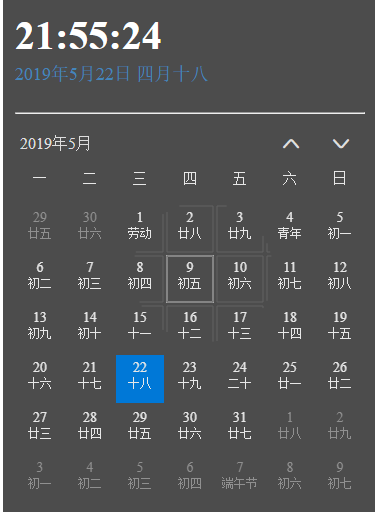

### 高仿win10 日历页面 还原度百分之90

-------

1. 项目构建
   构建项目基于webpack 构建， 想要测试效果的话需要安装nodejs，以及npm  
   clone 之后执行 下列操作  
       `npm i`  
   `npm run dev` 

2. 功能简介
    实现阳历阴历切换，日期选择等， 以及win10 日历探照灯阴影特效

****************

